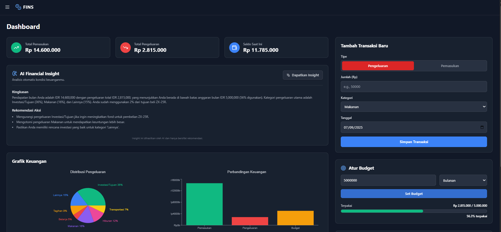

# 💸 FINS - Financial Insight
*Asisten Keuangan Pribadi Cerdas Berbasis AI*

[](https://react.dev/)
[](https://tailwindcss.com/)
[](https://supabase.com/)
[](https://research.ibm.com/ai-foundation-models)
[](https://replicate.com/)
[](https://www.netlify.com/)
[](LICENSE)



### **🚀 [Lihat Live Demo](https://finsid.netlify.app/)**

**FINS - Financial Insight** adalah aplikasi web *full-stack* yang dirancang untuk merevolusi cara pengguna mengelola keuangan pribadi. FINS tidak hanya berfungsi sebagai alat pencatat transaksi yang intuitif, tetapi juga sebagai asisten finansial cerdas yang didukung oleh AI dari **IBM Granite**. Aplikasi ini memberikan analisis mendalam, ringkasan yang mudah dipahami, dan rekomendasi praktis untuk membantu pengguna mencapai kesehatan dan tujuan finansial mereka.

---

## 📖 Daftar Isi
1.  [Gambaran Umum Proyek](#-gambaran-umum-proyek)
2.  [Fitur Unggulan](#-fitur-unggulan)
3.  [Arsitektur Aplikasi](#-arsitektur-aplikasi)
4.  [Tumpukan Teknologi](#️-tumpukan-teknologi)
5.  [Panduan Instalasi & Setup](#-panduan-instalasi--setup)
6.  [Penjelasan Dukungan AI](#-penjelasan-dukungan-ai)
7.  [Rencana Pengembangan](#-rencana-pengembangan)
8.  [Kontribusi](#-kontribusi)
9.  [Lisensi](#-lisensi)

---

## 🎯 Gambaran Umum Proyek

### Masalah yang Dipecahkan
Manajemen keuangan pribadi seringkali terasa reaktif, bukan proaktif. Banyak individu mencatat pengeluaran mereka tetapi kesulitan menerjemahkan data mentah tersebut menjadi wawasan yang dapat ditindaklanjuti. Mereka tahu *ke mana* uang mereka pergi, tetapi tidak tahu *bagaimana* cara mengoptimalkannya untuk masa depan. Kesenjangan antara data dan keputusan ini menghambat kemajuan finansial.

### Solusi yang Ditawarkan
FINS mengatasi masalah ini dengan menjadi jembatan antara data dan wawasan. Dengan antarmuka yang bersih dan futuristik, FINS menawarkan:
-   **Pencatatan Tanpa Hambatan:** Memudahkan pengguna untuk mencatat pemasukan dan pengeluaran.
-   **Visualisasi Data:** Mengubah angka-angka membosankan menjadi grafik yang indah dan mudah dipahami.
-   **Insight Berbasis AI:** Memberikan analisis dan rekomendasi proaktif dari IBM Granite, mengubah pengguna dari sekadar pencatat menjadi perencana keuangan yang cerdas.

### Target Pengguna
Aplikasi ini dirancang untuk individu seperti mahasiswa, profesional, dan *freelancer*, yang ingin mengambil kendali penuh atas keuangan mereka dengan bantuan teknologi modern.

---

## ✨ Fitur Unggulan

FINS dikemas dengan fitur-fitur canggih untuk memberikan pengalaman manajemen keuangan yang lengkap:

-   🔐 **Autentikasi Aman & Isolasi Data:** Sistem login dan registrasi penuh menggunakan Supabase Auth. Setiap data pengguna diisolasi secara ketat menggunakan **Row Level Security (RLS)**, menjamin privasi dan keamanan data tingkat enterprise.
-   📊 **Dashboard Futuristik & Responsif:** Antarmuka utama yang menampilkan semua metrik keuangan penting dalam satu pandangan. Dirancang dengan *dark mode*, efek *glassmorphism*, dan animasi halus untuk pengalaman pengguna yang premium di semua perangkat.
-   💸 **Manajemen Transaksi Cerdas (CRUD):** Fungsionalitas penuh untuk membuat, membaca, dan menghapus transaksi. Halaman Riwayat dilengkapi dengan filter interaktif dan fitur pencarian *real-time*.
-   🎯 **Tujuan Finansial Realistis:** Pengguna dapat menetapkan tujuan (misal: "Dana Darurat", "Beli Laptop Baru").
    -   **Logika Sinkronisasi Unik:** Menambah progress ke sebuah tujuan secara otomatis akan membuat **transaksi pengeluaran baru** dengan kategori "Investasi/Tujuan". Ini memastikan saldo pengguna berkurang secara realistis dan tersinkronisasi penuh dengan grafik keuangan.
    -   **Validasi Saldo:** Pengguna tidak dapat menabung untuk tujuan melebihi saldo yang mereka miliki.
-   🧠 **AI Financial Insight (IBM Granite):** Fitur pembeda utama aplikasi.
    -   Dengan satu klik, AI IBM Granite akan menganalisis data keuangan pengguna.
    -   Outputnya berupa **ringkasan kondisi keuangan**, 3 **rekomendasi praktis**, dan **saran darurat** jika pengguna melebihi budget, semuanya dalam Bahasa Indonesia.
    -   Menggunakan **Netlify Functions** sebagai *backend proxy* yang aman dan **caching di `localStorage`** untuk menghemat penggunaan token API secara drastis.
-   🔧 **Kustomisasi Penuh:** Pengguna dapat **menambah, mengedit, dan menghapus kategori** pengeluaran dan pemasukan mereka sendiri melalui halaman Pengaturan, membuat FINS beradaptasi dengan gaya hidup finansial mereka.

---

## 🏗️ Arsitektur Aplikasi

FINS dibangun di atas arsitektur *full-stack* modern yang memisahkan antara frontend dan layanan backend.

-   **Frontend (Klien):** Sebuah React SPA (Vite) yang bertanggung jawab untuk semua antarmuka pengguna dan interaksi.
-   **Backend Services (Layanan):**
    1.  **Supabase (BaaS):** Bertindak sebagai backend utama.
        -   React Client berkomunikasi langsung dengan **Supabase Auto-generated API** untuk semua operasi data (CRUD) dan autentikasi.
        -   **Row Level Security (RLS)** di database PostgreSQL memastikan setiap pengguna hanya dapat mengakses datanya sendiri.
    2.  **Netlify Functions (Serverless):** Bertindak sebagai *backend proxy* yang aman.
        -   React Client mengirim permintaan ke **Netlify Function Endpoint** (`/.netlify/functions/getAIInsight`).
        -   Netlify Function kemudian mengambil API Key rahasia dari *environment variables* dan meneruskan permintaan ke **Replicate API (IBM Granite)**.
        -   Ini memastikan API Key Replicate tidak pernah terekspos ke browser.

---

## 🛠️ Tumpukan Teknologi

| Kategori | Teknologi | Alasan Pemilihan |
| :--- | :--- | :--- |
| **Frontend** | React (Vite) + Tailwind CSS | React menyediakan arsitektur berbasis komponen yang modular. Vite dipilih karena kecepatan *development server*-nya. Tailwind CSS memungkinkan pembuatan UI yang konsisten dan responsif dengan cepat. |
| **Backend & Database** | Supabase | Dipilih sebagai solusi BaaS untuk akselerasi pengembangan, menyediakan Database PostgreSQL, Autentikasi, dan API otomatis yang aman dengan RLS. |
| **Serverless Backend** | Netlify Functions | Digunakan sebagai *backend proxy* yang aman untuk berkomunikasi dengan API eksternal (Replicate), memastikan API key sensitif tetap aman. |
| **Integrasi AI** | Replicate API + IBM Granite | Replicate menyederhanakan pemanggilan model AI. **IBM Granite (`granite-3.1-8b-instruct`)** dipilih karena kemampuannya mengikuti instruksi untuk menghasilkan output JSON yang terstruktur. |
| **Routing** | React Router | Standar industri untuk navigasi di React, digunakan untuk mengelola rute statis dan dinamis (`/goals/:goalId`). |
| **State Management** | React Hooks (`useState`, `useEffect`) | State aplikasi dipusatkan di `App.jsx` (*Lift State Up*). Efektif dan mudah dikelola untuk skala proyek saat ini. |
| **Deployment** | Netlify | Menyediakan alur kerja CI/CD yang mulus dari GitHub, serta hosting terintegrasi untuk *frontend* dan *serverless functions*. |

---

## 🚀 Panduan Instalasi & Setup

Untuk menjalankan proyek ini secara lokal, ikuti langkah-langkah berikut:

### Prasyarat
-   Node.js (v18+)
-   npm / yarn / pnpm
-   Akun [Supabase](https://supabase.com), [Replicate](https://replicate.com), dan [Netlify](https://netlify.com)
-   Netlify CLI: `npm install netlify-cli -g`

### 1. Clone & Instalasi
```bash
# Clone repositori
git clone https://github.com/[USERNAME]/[NAMA-REPO].git
cd [NAMA-REPO]

# Install dependencies
npm install
```

### 2. Setup Environment Variables
Buat file `.env` di folder utama dan isi dengan kunci dari akun Supabase dan Replicate Anda:
```env
# Diambil dari Dashboard Supabase > Settings > API
VITE_SUPABASE_URL="https://...supabase.co"
VITE_SUPABASE_ANON_KEY="ey..."

# Diambil dari Dashboard Replicate > API tokens
REPLICATE_API_TOKEN="r8_..."
```

### 3. Setup Database Supabase
1.  Buat proyek baru di Supabase.
2.  Gunakan **SQL Editor** untuk membuat tabel: `transactions`, `goals`, `budget`, dan `categories`.
3.  Konfigurasi **Foreign Key** untuk setiap kolom `user_id` agar merujuk ke `auth.users(id)`.
4.  Aktifkan **Row Level Security (RLS)** untuk setiap tabel dan buat *policies* untuk `SELECT`, `INSERT`, `UPDATE`, `DELETE`.
5.  Jalankan query SQL untuk membuat dan memberikan izin pada fungsi `reset_user_data`.

### 4. Jalankan Secara Lokal
Gunakan Netlify Dev untuk menjalankan server frontend dan backend secara bersamaan.
```bash
# Hubungkan ke akun Netlify
netlify login

# Hubungkan ke situs Netlify yang sudah dibuat
netlify link

# Jalankan server
netlify dev
```
Aplikasi akan tersedia di `http://localhost:8888`.

---

## 🤖 Penjelasan Dukungan AI

AI digunakan dalam dua kapasitas krusial dalam proyek ini: sebagai **Partner Pengembangan** dan sebagai **Fitur Inti Aplikasi**.

### 1. AI sebagai Partner Pengembangan (Menggunakan ChatGPT/LLM)
Selama seluruh siklus pengembangan, Large Language Models (LLM) digunakan untuk:
-   **Akselerasi & Prototyping:** Menghasilkan kode *boilerplate* untuk komponen, struktur, dan konfigurasi.
-   **Debugging Cerdas:** Menganalisis log error yang kompleks dan memberikan solusi yang tepat sasaran.
-   **Saran Arsitektur:** Memberikan rekomendasi untuk menggunakan arsitektur modern seperti BaaS, *serverless functions*, dan strategi *state management*.

**Dampak Nyata:** Penggunaan AI sebagai partner telah **mempercepat waktu pengembangan secara drastis** dan meningkatkan kualitas arsitektur aplikasi menjadi lebih aman dan modern.

### 2. AI sebagai Fitur Inti Aplikasi (Menggunakan IBM Granite)
-   **Tujuan Fitur:** Memberikan nilai tambah yang unik, mengubah FINS dari alat pencatat pasif menjadi asisten finansial aktif.
-   **Implementasi:** Menggunakan model **`ibm/granite-3.1-8b-instruct`** melalui Replicate API. Panggilan diamankan dengan *backend proxy* di Netlify Functions. *Prompt engineering* yang cermat digunakan untuk memastikan AI memberikan output JSON yang relevan dalam Bahasa Indonesia.
-   **Hasil Aplikasi:** Fitur "AI Financial Insight" menjadi pembeda utama aplikasi ini, memberdayakan pengguna untuk mengambil keputusan finansial yang lebih baik.

---

## 🤝 Kontribusi
Saat ini proyek ini dikelola secara pribadi, namun masukan dan saran sangat diterima. Silakan buka *issue* di repositori ini untuk diskusi lebih lanjut.

## 📜 Lisensi
Proyek ini dilisensikan di bawah **Lisensi MIT**.
